<h3><code>bhavya@github ~ $ whoami</code></h3>

<table>
<tr>
<td valign="top"></td>
<td valign="top"></td>
</tr>
</table>

<h3><code>bhavya@github ~ $ ./contributions.sh</code></h3>

<h3><code>bhavya@github ~ $ cat about.txt</code></h3>

I find how AI systems fail before a user or an attacker does. My background is software QA (product verification at Ciena), and I now focus on testing and red-teaming LLM applications: prompt injection, system-prompt extraction and multi-turn social engineering.

- 🔭 **[threatline](https://github.com/BBcommits/threatline)**: an automated multi-turn prompt-injection test harness for LLM apps
- 📓 **[redteam-journal](https://github.com/BBcommits/redteam-journal)**: Gray Swan Arena and PortSwigger Web Security Academy write-ups
- 🐍 **[python-practice](https://github.com/BBcommits/python-practice)**: daily Python
- 🎯 Working toward CompTIA Security+

<h3><code>bhavya@github ~ $ ./links.sh</code></h3>

  

<picture>
  <source media="(prefers-color-scheme: dark)" srcset="https://raw.githubusercontent.com/BBcommits/BBcommits/output/github-snake-dark.svg" />
  
</picture>

